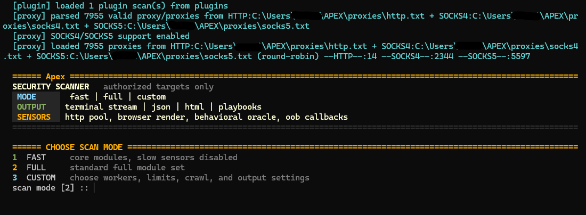

# Apex



Apex is a Python security scanner for authorized web application assessments. It combines fast HTTP checks, template-based probes, local source/SBOM review, proxy support, replayable evidence, and rich JSON/HTML/SARIF/Markdown reporting.

> Use Apex only on systems you own or have explicit permission to test.

## What It Does

- Runs targeted or broad web security scans from one CLI.
- Produces JSON, HTML, SARIF, Markdown, HAR, replay packs, and resumable state.
- Supports HTTP, HTTPS, SOCKS4, and SOCKS5 proxies through the `proxies/` folder.
- Loads optional custom scan plugins from `plugins/`.
- Runs simple Nuclei-style templates from `templates/`.
- Can scan local source trees and dependency manifests for secrets, dangerous APIs, and dependency hygiene.
- Includes scan memory, replay comparison, self-debugging coverage hints, and next-action recommendations.

## Requirements

- Python 3.10+ recommended.
- Optional packages improve coverage:
  - `urllib3` for pooled HTTP behavior.
  - `PySocks` for SOCKS proxy support.
  - `selenium` or Playwright for browser/headless checks.

Run the built-in environment check:

```powershell
python Scanner.py --doctor --doctor-json doctor.json --no-prompt
```

## Quick Start

Run a small scan and write reports:

```powershell
python Scanner.py https://example.com --only headers,tech,sectxt --json scan.json --html-report scan.html --no-prompt
```

Run the broader preset:

```powershell
python Scanner.py https://example.com --scanner-parity --no-prompt
```

Run all modules with resumable state:

```powershell
python Scanner.py https://example.com --all --resume customer_a.json --json customer_a.json --html-report customer_a.html --no-prompt
```

List available scans:

```powershell
python Scanner.py --list-scans
python Scanner.py --list-scans-json
```

## Common Workflows

Template checks:

```powershell
python Scanner.py https://example.com --nuclei-lite --templates templates --html-report template_scan.html --no-prompt
```

Local source and dependency review:

```powershell
python Scanner.py --source-scan --sbom-scan --source-dir . --json local_review.json --no-prompt
```

Replay and evidence:

```powershell
python Scanner.py https://example.com --http-evidence --replay-pack replay_pack.json --json scan.json --no-prompt
```

Compare against a previous report:

```powershell
python Scanner.py https://example.com --json current.json --compare output\reports\old.json --no-prompt
```

Clean proxy lists:

```powershell
python proxies\sort_proxies.py proxies --dedupe --sort-speed --progress
```

More examples live in [examples/commands.md](examples/commands.md).

## Project Layout

- `Scanner.py` - main CLI and scanner runtime.
- `scanner/` - reusable modules for models, reports, registry, helpers, and moved scan logic.
- `templates/` - starter Nuclei-lite JSON/YAML templates.
- `plugins/` - optional user plugin scans.
- `proxies/` - local proxy lists and proxy cleaner tool.
- `wordlists/` - default fuzzing wordlists.
- `examples/` - ready-to-copy command examples.
- `output/` - generated reports, logs, evidence, and state.
- `tests/` - regression tests.

## Reports And Output

By default, simple report names are placed under `output/reports/`. Other generated files are grouped under `output/evidence/`, `output/logs/`, `output/pocs/`, and `output/state/`.

The repository ignores generated output files so releases stay clean. Keep any assessment results outside Git unless you intentionally need to preserve them.

## Plugins

Drop plugin `.py` files into `plugins/`. Each plugin can expose a `SCANS` list or a simple `scan(base)` function. See [plugins/README.md](plugins/README.md).

## Templates

Drop JSON/YAML templates into `templates/` and run `--nuclei-lite`. See [templates/README.md](templates/README.md).

## Proxies

Put local proxy lists into `proxies/http.txt`, `proxies/socks4.txt`, and `proxies/socks5.txt`. These files are ignored by Git by default because proxy lists are local working data. See [proxies/README.md](proxies/README.md).

## Development Checks

```powershell
python -m compileall -q Scanner.py scanner plugins proxies tests
python -m unittest discover -s tests -v
python Scanner.py --audit-scanner --no-proxy --no-prompt
python Scanner.py --module-self-test --no-proxy --no-prompt
```

